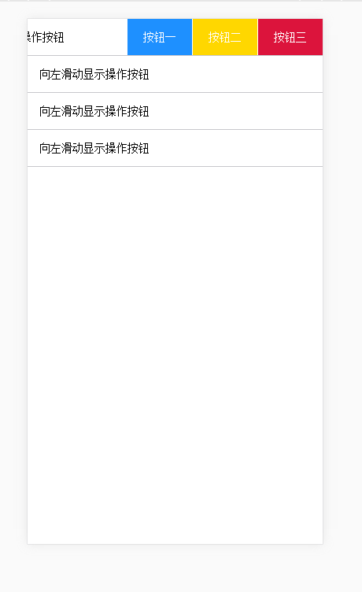

# <a target="_blank" href="https://shuisanqian.github.io/myExample/touch/index.html">touchSilde</a>

一个移动端向左滑出操作栏的小插件。<br>
  例:
```javascript 
     new touchSlide({
          ele:'.slide-list'
     });
 ```
     


